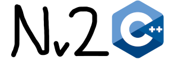

# Nv2cpp

**Nv2cpp** is a C++ reimplementation of the original Nv2 game by MetaNet Software.  
This project aims to modernize the game using SDL3 and OpenGL for easier maintenance and future improvements.

---

## Legal Notice

- The original N (version 2.0) game code is owned by MetaNet Software.  
- This project is a reverse-engineered reimplementation, without using the original source code.  
- The original N logo is **not included** in this project to avoid trademark conflicts.  
- All trademarks and logos belong to their respective owners.

---

## Docs

Click [here](docs/Main.md) to read the docs.

## License

This project is licensed under the **MIT License**.

---

## Building

Requires SDL3, OpenGL, and a C++17 compatible compiler.
